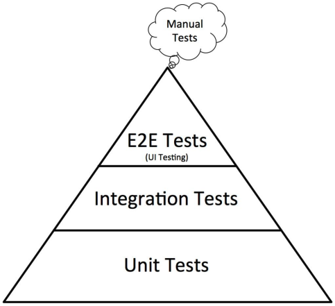

# <div id="content">Content</div>

- <a href="#VueJS">VueJS</a>
- <a href="#directives">Vue Directives</a>
- <a href="#unit_testing">Unit Testing (Vitest)</a>
- <a href="#user_stories">User Stories</a>

# <div id="VueJS">VueJS <a href="#content">⬆️</a></div>

- JavaScript framework for building reactive (able to react to change) user interfaces.
- Vue ecosystem including Vue Router and Pinia.
- Unit Testing with Vue Testing Library and vitest.
- Coverage of front end tools like Vite, TailswindCSS and TypeScript.
- Project similar to `careers.google.com`
- `Create Vue` is a tool for creating a Vue project from scratch. It runs on the Vite build tool.
- `Hot Reloading` is a feature that re-renders our Vue application when code changes in our editor.

## Mounting the Vue App

- The `index.html` file is the barebone and consists of a single `<div>`
- We create the Vue app by mounting a root component inside the `<div>`. Vue takes care of all future DOM updates.

```js
<div id="app"></div>
```

## The `scoped` Attribute

- The `scoped` attribute restricts the styles defined inside it to only affect elements within that specific component's `<template>`, providing encapsulated styles.

```html
<style scoped>
  h1 {
    color: red;
  }
</style>
```

## Different ways to render a component

- They are render the component in the same way.

```js
  <MainNav />
  <MainNav></MainNav>
  <main-nav /> // kebab-case
  <main-nav></main-nav>
```

## `name` property

- Defines the component's name. Need at least 2 words, cannot be like 'Main'

```html
<script>
  export default {
    name: 'MainNav',
  };
</script>
```

## Rendering Data to View

- `data()` function is used to define the data properties for a component.
- In this example, it defines a single data property called `company` with the value `'Leon Careers'`, which can be accessed and rendered in the component's template or methods.

```js
<template>
  <a href="/">{{ company }}</a>
</template>

data() {
  return {
    company: 'Leon Careers'
  }
}
```

## ARIA Roles

- **Accessibility** means designing websites/apps to be capable of being used by as many people as possible.
- Users of our application may not be able to use a mouse or a keyboard. Users may be using a screen reader or another assistive technology to parse the website.
- Examples of Accessibility:
  - The `alt` tag provides context to users who may have visual impairments. It also helps all users if the image fails to load for some reason (server's down, slow connection, etc).
  - A **responsive design** ensures users on different devices (desktop computers, phones, tablets) can use our website.

---

#### WAI-ARIA Roles

- By default, many semantic elements in HTML have a role. For example, `<input type="radio">` has the "radio" role.
- Non-semantic elements in HTML do not have a role; `<div>` and `<span>` without added semantics return `null`. The `role` attribute can provide semantics.
- ARIA roles are added to HTML elements using `role="role type"`, where _role type_ is the name of a role in the ARIA specification.
- Some roles require the inclusion of associated ARIA states or properties, others are valid in association with other roles.

---

## Component Methods

- Can attach **methods** to our component.
- The methods can access "data" properties via the `this` keyword.
- Vue re-renders a component template whenever a piece of `data` changes.

## Passing Props

- Passing data from parent component to child components.
- To pass in a **boolean**/array/object/... value as prop, use the v-bind syntax `:is-primary="false"`. If it is a string, then don't need to use `v-bind`.
  - Vue interprets prop values as _strings_, thus use `v-bind` to pass dynamic values (arrays, objects, Booleans, or **data** properties).

```js
// ParentComponent
<div>
  <ActionButton text="Sign In" @click="loginUser" />
</div>

// Child Component
<template>
  <button>
    {{ text }}
  </button>
</template>

<script>
export default {
  name: 'ActionButton',
  props: ['text']
}
</script>
```

## `computed` property

- Used to define properties in a component that are **calculated based on other data properties**.
- Create reactive properties that automatically update whenever their dependent properties change.
- In this example, we are using a reusable button component where you can customize the looks of the button by passing in props into the Button component.

```js
// ParentComponent
<ActionButton text="Sign In" type="primary" @click="loginUser" />

// ChildComponent
<template>
  <button :class="buttonClass">
    {{ text }}
  </button>
</template>

<script>
export default {
  name: 'ActionButton',
  props: ['text', 'type'],
  computed: {
    buttonClass() {
      return { primary: this.type === 'primary', secondary: this.type === 'secondary' }
    }
  }
}
</script>
```

## CSS Class

- Can combine `v-bind` with the `class` attribute to provide dynamic styles to a HTML element.
- Vue expects a JavaScript object where the properties are class names and the values are Booleans.
  - `true` means "apply this CSS class" and `false` means "do not apply this class".
- For example the CSS class is `primary`, it should be represented as `:class="{ primary: true }"` in the component.

```js
<template>
  <button :class="buttonClass">
    {{ text }}
  </button>
</template>

...

computed: {
  buttonClass() {
    return {
      [this.type]: true // { primary: true } or { secondary: true }
    }
  }
}
```

## Prop Validation

- Can add validation to our prop such as the data type, optional/required, and a default value. Vue will inform us of violations in the browser console. Tests will sometimes catch violations too.
- Add the `validator` method to a prop validation object to validate custom business logic.

## Global Components

- E.g., font awesome icons
- Global components can be used in any Vue component. We do not need to import them and register them locally.
- Be careful with global components, as they can increase your bundle size.
- Font Awesome is a collection of free icons.

## Rendering Font Awesome Icon

- We rendered a `<font-awesome-icon> component and used` its `icon` prop to customize the actual icon.
- Use a `v-bind` directive whenever passing a prop value that is **not a string**.

---

#### Testing

- A stub is a replacement or stand-in for a real component. Can use it to simplify tests by focusing on the component under test.
- Can tell Vue Testing Library which to stub out global components. We used this technique to stub out the `FontAwesomeIcon` component.

---

## Component Lifecycle Hooks

- [Lifecycle Hooks](https://vuejs.org/guide/essentials/lifecycle.html)
- `beforeCreate()`, `created()`, `beforeMount()`, `mounted()`
- Vue components have **lifecycle hooks** that run at different moment's of the component's existence.
- We used the `created` hook to setup an interval to change the text being rendered in our `TheHeadline` component. We also hooked into the `beforeUnmount` hook to remove the interval.

## 2-Way Data Binding in Forms

- From data to UI and UI to data.

```js
// Method 1:
<input :value="role" @input="updateRole" />

methods: {
  updateRole(event) {
    this.role = event.target.value
  }
}

// Method 2:
<input :value="location" @input="location = $event.target.value" />

// Method 3: Using `v-model`
<input v-model="role" />
```

## Communication from Child to Parent Component (`TextInput.vue`)

---

#### `$emit` method

- Vue components have access to an `$emit` method via the `this` keyword.
- The `$emit` method sends a message/event to the parent component.
- The first argument to `$emit` is the event name. The follow-up arguments represent the data that we would like to pass up.
- In the parent component, we can react to a child component's emitted event using the `v-on` directive (or `@` shortcut).
- To invoke a component method for each emitted event, declare the method in the `methods` object and provide its name. `@handleInput="someMethod"`
- Can also react to a emitted event inline. To access the data/payload from the child, use the `$event` keyword.
- Can use the `v-model` directive on a Vue component if we provide a `modelValue` prop and emit an `update:modelValue` event.
- To declare the limited events that a component can emit, provide an `emits` property to the configuration object.
- Set the `emits` key equal to an array of strings representing the event names.
- In the unit test suit, the `emitted` method returns an object that keeps track of a component's emitted events.
- The properties will be the event names. The values will be arrays of arrays. Each nested array stores the data/arguments that the event included.

---

- From Child component, use `this.$emit("handleInput", this.value)` to emit an event from the child to parent component.
- In Parent component, use `<text-input @handle-input="updateLocation" />` to receive the event/payload.

```js
// Child Component
<input
  type="text"
  :value="value"
  class="w-full text-lg font-normal focus:outline-none"
  @input="handleInput"
/>

props: {
  value: {
    type: String,
    required: true
  }
},
methods: {
  handleInput($event) {
    // passing value from Child component to Parent component
    // the payload in this event is `this.value`
    this.$emit('handleInput', $event.target.value)
  }
}

// Receiving Payload in Parent Component
// Method 1:
<text-input @handle-input="updateRole" />

updateRole(payload) {
  this.location = payload
}

// Method 2 (Less code):
<text-input :value="role" @handle-input="role = $event" />

// Method 3 (v-model):
// Child Component
emits: ["update:modelValue"],
methods: {
  handleInput($event) {
    // passing value from Child component to Parent component
    // the payload in this event is `this.value`
    this.$emit('update:modelValue', $event.target.value)
  }
}

// Parent Component
<text-input v-model="role" placeholder="Software engineer" />
```

- How the logic works? Referring to Method 2
  1. As the user types, the `handleInput` method is triggered in the Child component `TextInput.vue` which emits an event to the parent component.
  2. In the parent component, it assigns the emitted event from the child component to the data property `role`.
  3. The data property `role` is then assigned to the prop value and this prop value is passed down to the Child component that saves in the `value` of `<input>`.

# <div id="directives">Directives <a href="#content">⬆️</a></div>

## `v-bind` Directive

- Binding a HTML _attribute_ to a piece of data in the component.
- Use `:attr` as a shortcut to `v-bind:attr`.

```js
<a v-bind:href="url">Leon Careers</a>;

export default {
  name: 'MainNav',
  data() {
    return {
      url: 'https://careers.google.com',
    };
  },
};
```

```js
// Another way to avoid eslint violation, just add a colon (recommended)
<a :href="url">Leon Careers</a>;
```

## `v-for` Directive

- Need to bind a unique value to the `key` attribute in a `v-for` to enable Vue to differentiate between the elements.
- Can configure Tailwind utility classes that apply a style to only the _first child_ element in a group.

```js
<li v-for="menuItem in menuItems" :key="menuItem" class="ml-9 h-full">
    <a href="">{{ menuItem }}</a>
</li>

menuItems: ['Teams', 'Locations', 'Life at Leon Careers', 'How we Hire', 'Students', 'Jobs']
```

---

#### Using tailwind's first child utility class

- Applies margin-left 0 to the first element in the `v-for` loop

```js
class="first:ml-0 ml-9 h-full"
```

---

## `v-if` Directive

- Conditionally render a part of the template.

```js
<ActionButton v-if="false" />
```

## `v-else` Directive

- `v-if` must be present for this to work.
- Renders a chunk of HTML if the `v-if` directive evaluates to false.

```js
<ProfileImage v-if="isLoggedIn" />
<ActionButton v-else />
```

## `v-on` Directive

- `v-on` directive declares a method for Vue to invoke whenever an event occurs. For example, `v-on:click` will react to a user click.
- `@` is a shortcut for `v-on`. For example, we can write `@click` instead of `v-on:click`.
- Don't invoke the `v-on` method, Vue will run it automatically.
- Vue passes an event object to a `v-on` method whenever it invokes it. The event object includes information/metadata about the event.

```js
v-on:click="handleClick"
@click="handleClick" // this syntax works too

<script>
export default {
  name: 'ActionButton',
  methods: {
    handleClick() {
      console.log('I have been clicked!')
    }
  }
}
</script>
```

## `v-model` Directive

- The `v-model` directive creates 2-way data binding between a user input and a `data` property.
- Can manually configure this functionality by `v-binding` to the `value` attribute and reacting to the `input` event with `v-on:input` (aka `@input`).

# <div id="unit_testing">Unit Testing (Vitest) <a href="#content">⬆️</a></div>

- **Testing** means writing code that validates that our implementation code works as expected.
- We write **assertions** to validate certain expectations of our code.
- Reduces manual testing.

## Unit Testing Tools

- Vitest
  - Test runner that uses Vite build tool; super-fast
  - Similar syntax to Jest
- Vue Testing Library
  - For testing the rendering of components.
  - Wraps Vue Test Utils and DOM Testing Library under the hood
  - Allows us to mount and interact with Vue components in a simulated browser environment.

## What is unit test?

- A **unit test** tests a single piece of a program in isolation.
- A **unit test** should be lightweight and should run fast.
- If there are dependencies, the unit test should **mock or stub** them out.

## Testing Pyramid



## Basics of Vitest Syntax

- `describe`: This function used to **group together related test cases**, providing a way to organize and categorize tests. It takes 2 arguments - the description of the test suite and a callback function containing the individual test cases (`it` blocks) within that suite.
- `it`: This function represents an **individual test case**. It takes 2 arguments - the description of the test and a callback function that contains the actual test logic, including assertions using `expect`.
- `expect`: This is an **assertion** library method used to define expectations in the test cases. It allows you to check whether a certain condition is met during the execution of the test. Commonly used methods with `expect` include `toBe`, `toEqual`, `toBeTruthy`, `toBeFalsy`, `toContain`, `toThrow`, etc.

## Test-Driven Development (TDD)

1. Write Tests first.
2. Write the implementation code that makes the test pass.
3. Improve code without changing its underlying purpose as you can run the tests to check that the code still works.

---

#### Benefits

1. Ensure you are testing the right thing.
2. Avoid duplication of tests.
3. Describe the "why" rather than the implementation.
4. Higher test coverage.
5. Makes code easy to refactor. If you make changes to your code, you can run the tests to check if the code is still behaving as it should.
6. Leads to higher-quality tests and implementation code.

---

## Vue Testing Library

```js
import { render, screen } from '@testing-library/vue';

import MainNav from '@/components/MainNav.vue';

describe('MainNav', () => {
  it('displays company name', () => {
    render(MainNav);
    screen.debug();
  });
});
```

- `render` function is used to **render a Vue component for testing purposes** to a virtual DOM, allowing you to interact with and inspect the component's rendered output and behavior.
- `screen` is an object that contains various utility methods for querying and interacting with the rendered component's elements, such as `screen.debug()` which prints the component's current DOM structure to the console for debugging purposes.

## Vue Testing Components

```js
render(MainNav);
const companyName = screen.getByText('Leon Careers');
expect(companyName).toBeInTheDocument(); // querying that the company name is in the DOM
```

- Rendering the expected company name and ensuring it is displayed in the virtual HTML DOM.

```js
render(MainNav, {
  data() {
    return {
      company: 'Leon Careers',
    };
  },
});
```

- Optional to customize certain aspects of the component (e.g.,companyName value) in the second argument of the `render` function.

## `screen`

- `screen` object to query/search the DOM for elements in various ways (by role, by text, by label, etc).
- The second argument to a `screen` method is an object where we can customize the search criteria. Usually use `name`

|    Methods    | Description                                                                                                                                |
| :-----------: | ------------------------------------------------------------------------------------------------------------------------------------------ |
|    `getBy`    | Searches for 1 HTML element with the given criteria. Vue Testing Library recommends `getByRole` if possible. Raises an error if not found. |
|  `getByText`  | Search by text.                                                                                                                            |
|  `getAllBy`   | Returns an array of all matching elements based on some criteria.                                                                          |
|   `queryBy`   | Return `null` if an element cannot be found.                                                                                               |
| `toHaveClass` | Verifies that a DOM node has a specific CSS class attached to it.                                                                          |

## `expect`

|  Methods  | Description |
| :-------: | ----------- |
| `toEqual` |             |

## Unit Testing of ARIA Roles

```js
it('displays menu items for navigation', () => {
  render(MainNav);
  screen.getAllByRole('listitem');
});
```

## `userEvent` object

- The `userEvent` object from `@testing-library/user-event` simulates user events on the virtual DOM used by Vue Testing Library. Its methods represent the events.
- The event methods are _asynchronous_. They return a Promise. Use `async/await` syntax for the `it` function.

```js
it('displays user profile picture', async () => {
  render(MainNav);

  let profileImage = screen.queryByRole('img', {
    name: /user profile image/i,
  });
  expect(profileImage).not.toBeInTheDocument();

  const loginButton = screen.getByRole('button', {
    name: /sign in/i,
  });
  await userEvent.click(loginButton); // simulating login button click with await

  profileImage = screen.getByRole('img', {
    name: /user profile image/i,
  });
  expect(profileImage).toBeInTheDocument();
});
```

## Unit Testing on CSS classes

```js
it('applies one of several styles to button', () => {
  render(ActionButton, {
    props: {
      text: 'Click Me',
      type: 'primary',
    },
  });

  const button = screen.getByRole('button', {
    name: /Click Me/i,
  });
  expect(button).toHaveClass('primary'); // testing CSS class name
});
```

## [Vue Warn]: Failed to resolve component

- Vue throws this error because it does not know what font-awesome-icon package is.
- Have to use **stubs** to act as a replacement which is something lightweight by Vue Testing Library.

```
[Vue warn]: Failed to resolve component: font-awesome-icon
If this is a native custom element, make sure to exclude it from component resolution via compilerOptions.isCustomElement.
  at <TheSubnav key=0 >
  at <MainNav ref="VTU_COMPONENT" >
  at <VTUROOT>
```

```js
// Stubbing the FontAwesomeIcon by giving the `render()` function a second argument
render(TheSubnav, {
  global: {
    stubs: {
      FontAwesomeIcon: true,
    },
  },
});
```

## Vitest: Mock Function

- To move logic out of the component so that we can test the logic and the component in isolation.
- The Vitest mock function `vi.fn()` "mocks out" a real function. We use it as a stand-in or a replacement for a real function that we do not want to involve in our tests.

```js
describe('Vitest playground', () => {
  it('tracks whether it has been called', () => {
    const mockFunction = vi.fn();
    mockFunction(1, 2);
    expect(mockFunction).toHaveBeenCalledWith(1, 2);
  });
});
```

## `vi` Vitest Methods

- `vi.useFakeTimers` method auto-mocks JavaScript's timer functions (`setTimeout`, `setInterval`, etc).
- `vi.useRealTimers` method returns the mocked functions to their original, native JavaScript implementations.
- `vi.advanceTimersToNextTimer` method simulates the passage of an interval
  - Can also use `vi.advanceTimersByTime(3000)` with the passed milliseconds
- `vi.stubGlobal` method mocks out a global function with a specified mock. We can retain access to the mock as a constant.
- `nextTick` method waits for the component's DOM updates to be applied. It is an asynchronous function so need to use `async` and `await`. We use it to "wait" in our tests.

# `beforeEach` and `afterEach`

- `beforeEach` function executes a function before each test run. We can use it to run shared setup code for tests.
- `afterEach` function executes a function after each test run. We can use it to run shared cleanup code for tests.

## Testing `time-related` operations

```js
it('displays introductory action verb', () => {
  vi.useFakeTimers(); // use fake timers to control time-related operations
  render(TheHeadline);

  const actionPhrase = screen.getByRole('heading', {
    name: /build for everyone/i,
  });
  expect(actionPhrase).toBeInTheDocument();

  vi.useRealTimers(); // clean up function for timers (reset to JavaScript timer)
});

it('changes action verb at a consistent interval', () => {
  vi.useFakeTimers();
  const mock = vi.fn(); // creating a mock function
  vi.stubGlobal('setInterval', mock); // replacing global name with whatever we want

  render(TheHeadline);

  expect(mock).toHaveBeenCalled();

  vi.useRealTimers();
});
```

# <div id="user_stories">User Stories<a href="#content">⬆️</a></div>

- As a user, I would like to navigate between the pages of the career site.
- As a user, I would like to be able to log into the careers website. When I log in, I want to see my profile picture so that I know I have logged into the correct account.
- As a user, I would like to have my primary and secondary actions suggested to me so that I know what steps I can take on the website.
- As a user, I would like to know the number of jobs that matched my search results so that I can be sure my filters are being applied.
- As a user, I would like to know what I can do at the company so that I get excited about working for the company.
- As a user, I would like to provide the role that I am interested in and the city I would like to work in so that I can find job listings that are relevant to me.
