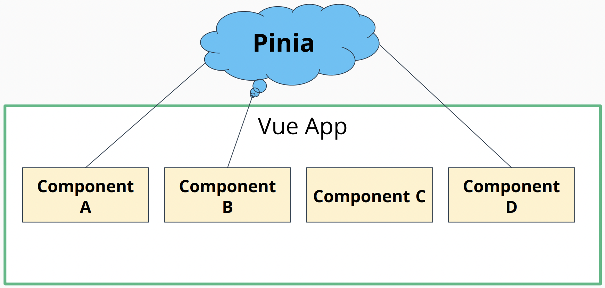

# Pinia



- Vue applications consist of state. **State** is the data that components rely on.
- Vue is reactive. When the state changes, Vue updates the view.
- Complexity creeps into an application when multiple components share a common state.
- **Pinia** is a state management library for Vue applications.
- Pinia is a library for managing global state (i.e., data that multiple components rely on).
- Pinia is a store library for Vue, it allows you to share a state across components/pages.
- Pinia was preceded by Vuex.

## Benefits of Pinia

- Separates the data manipulation from the view.
- Pinia exists independently of the components, so it can also be **unit tested by itself**. It doesn't have to know which components it is connected to or how many components it is connected to.
- Similar to Redux in React.

## Importing Pinia

- The `createPinia` function creates a global Pinia store. We configured the Pinia instance in our `main.js` file.

```js
// main.js
import { createPinia } from 'pinia';
createApp(App).use(pinia);
```

## Creating a simple Pinia store

- The `defineStore` function defines a "store", which can think of as a slice/fragment of the global Pinia store.
- The `state` method returns the initial state of the store.
- The `actions` method modify/mutate the store state.

```js
import { defineStore } from 'pinia';

export const useUserStore = defineStore('user', {
  state: () => ({
    isLoggedIn: false,
  }),
  actions: {
    loginUser() {
      this.isLoggedIn = true;
    },
  },
});
```

## Referencing Pinia store in Vue components with `mapStores`

- The `mapStores` helper function connects a Pinia store to a component property accessible via the `this` keyword.
- Pinia will concatenate the prefix/ID we provided to defineStore with `Store`. For example, we chose `user` so we reference `userStore` in our `MainNav` component.

```js
// Pinia Store
export const useUserStore = defineStore('user', {...})

// Component
import { mapStores } from 'pinia';
import { useUserStore } from '@/stores/user';

computed: {
  ...mapStores(useUserStore), // "user" --> "userStore"
  headerHeightClass() {
    return {
      'h-16': !this.userStore.isLoggedIn,
      'h-32': this.userStore.isLoggedIn
    }
  }
}
```

- Reference methods in Pinia store action

```js
<ActionButton v-else text="Sign In" type="primary" @click="userStore.loginUser" />
```

## Referencing Pinia store in Vue components with `mapState` and `mapActions`

- Can use `mapState` and `mapActions` instead of `mapStores`.
- **Main Benefit**: Can selectively extract and use only the states and methods you need from the store, rather than importing the entire store object. This results in more efficient and focused component rendering, as only the necessary data and actions are available as computed properties and methods on `this`.
- The `mapState` function pulls in specific store state properties and makes them available on `this` as computed properties.
- The `mapActions` function pulls in specific store methods and makes them available on `this` as methods.

```js
<ProfileImage v-if="isLoggedIn" />
<ActionButton v-else text="Sign In" type="primary" @click="loginUser" />

import { mapActions, mapState } from 'pinia'
import { useUserStore } from '@/stores/user'

computed: {
  ...mapState(useUserStore, ['isLoggedIn']),
  headerHeightClass() {
    return {
      'h-16': !this.isLoggedIn,
      'h-32': this.isLoggedIn
    }
  }
},
methods: {
  ...mapActions(useUserStore, ['loginUser'])
}
```

## Pinia Actions (API Calls)

- Actions can perform asynchronous operations like making API requests. They then update Pinia state with their responses.

```js
export const useJobsStore = defineStore('jobs', {
  state: () => ({
    jobs: [],
  }),
  actions: {
    async [FETCH_JOBS]() {
      const jobs = await getJobs();
      this.jobs = jobs;
    },
  },
});
```

- Moving logic out of components into Pinia actions separates concerns. It also allows other components to have access to Pinia state + actions.

# Pinia Getters

- A `getter` is a method that uses the Pinia store state to arrive at **computed/derived** data.
- When the Pinia state updates, the `getter` will rerun. It is analogous to a `computed` component property.
- A `getter` should not mutate the store state. That is the responsibility of an `action`.
- Avoid duplicate data/multiple sources of truth in Pinia store. Use `getters` instead. The user's filtered jobs is a perfect use case.
- Test `getter` methods like plain JavaScript methods. Provide an input and test for the correct output.
- Getters are similar to computed properties in Vue components, they are used to derive values based on the current state of the store and can be considered as a form of read-only computed properties for the store.

```js
export const useJobsStore = defineStore('jobs', {
  state: () => ({
    jobs: [],
  }),
  actions: {
    async [FETCH_JOBS]() {
      const jobs = await getJobs();
      this.jobs = jobs;
    },
  },
  getters: {
    [UNIQUE_ORGANIZATIONS](state) {
      const uniqueOrganizations = new Set();
      state.jobs.forEach((job) => uniqueOrganizations.add(job.organization));
      return uniqueOrganizations;
    },
  },
});
```

## Pinia Getters in components (`JobFiltersSidebarOrganizations.vue`)

- Use the `mapState` helper function to connect getters to components. They will be available on the `this` keyword.
- Defining getter names as constants allow you to provide constants for `mapState`, reducing the chance of typos.

```js
<li v-for="organization in UNIQUE_ORGANIZATIONS" :key="organization" class="h-8 w-1/2">

import { mapState, mapActions } from 'pinia'
import { useJobsStore, UNIQUE_ORGANIZATIONS } from '@/stores/jobs'

computed: {
  ...mapState(useJobsStore, [UNIQUE_ORGANIZATIONS])
},
```

## Pinia Getters with Arguments

- Getters can invoke other getters. We can delegate smaller bits of logic to lightweight getter functions.
- Think about how you can break up multiple responsibilities in a function. We do not have to use a getter in a component for it to be useful.
- We can provide additional arguments to a getter by having the getter method return a function. The function can accept whatever arguments.
- When we invoke the getter in a component, we pass arguments to it as if we are passing them to the returned function.

```js
  getters: {
    // Getter with custom parameter (by passing in a function as argument)
    [INCLUDE_JOB_BY_ORGANIZATION]: () => (job) => {
      const userStore = useUserStore()
      if (userStore.selectedOrganizations.length === 0) return true
      return userStore.selectedOrganizations.includes(job.organization)
    },
    [INCLUDE_JOB_BY_JOB_TYPE]: () => (job) => {
      const userStore = useUserStore()
      if (userStore.selectedJobTypes.length === 0) return true
      return userStore.selectedJobTypes.includes(job.jobType)
    },
    [FILTERED_JOBS](state) {
      return state.jobs
        .filter((job) => this.INCLUDE_JOB_BY_ORGANIZATION(job))
        .filter((job) => this.INCLUDE_JOB_BY_JOB_TYPE(job))
    }
  }
```

## Another way of Pinia Syntax (`degrees.ts`)

- Pass a function as the second argument to `defineStore`.
- Return an object with the reactive state, functions, and getters to expose to components.

```ts
import { ref, computed } from 'vue'
import { defineStore } from 'pinia'

import getDegrees from '@/api/getDegrees'
import type { Degree } from '@/api/types'

export const useDegreesStore = defineStore('degrees', () => {
  // state
  const degrees = ref<Degree[]>([])

  // actions
  const FETCH_DEGREES = async () => {
    const receivedDegrees = await getDegrees()
    degrees.value = receivedDegrees
  }

  // Getter
  const UNIQUE_DEGREES = computed(() => degrees.value.map((degree) => degree.degree))

  return { degrees, FETCH_DEGREES, UNIQUE_DEGREES }
})
```

# Unit Testing Pinia

#### Unit Testing Pinia store

```js
import { createPinia, setActivePinia } from 'pinia';

import { useUserStore } from '@/stores/user';
import { beforeEach } from 'vitest';

describe('state', () => {
  beforeEach(() => {
    setActivePinia(createPinia());
  });

  it('keeps track of if user is logged in', () => {
    const store = useUserStore();
    expect(store.isLoggedIn).toBe(false);
  });
});

describe('actions', () => {
  beforeEach(() => {
    setActivePinia(createPinia());
  });

  describe('loginUser', () => {
    it('logs the user in', () => {
      const store = useUserStore();
      store.loginUser();
      expect(store.isLoggedIn).toBe(true);
    });
  });
});
```

## `$onAction` method

- 

#### Unit Testing components that utilize Pinia store

- `const pinia = createTestingPinia({stubActions: false});`
  - Can use `createTestingPinia` in our **component tests** to have a global Pinia instance with writable state properties and actions replaced by mock functions.
  - If `stubActions` is false, the actual actions in the Pinia store will be executed when you call them in your test cases.
  - If `stubActions` is true (by default), the actions in the Pinia store will automatically be replaced with stubs (mock implementations) during testing.
- We can unit test Pinia stores in isolation. Access properties directly from the store and invoke actions as methods on the store.
- We added the Pinia testing library, which stubs out store actions when unit testing our components.

```js
// MainNav.test.js
import { createTestingPinia } from '@pinia/testing';
import MainNav from '@/components/Navigation/MainNav.vue';
import { useUserStore } from '@/stores/user';

const pinia = createTestingPinia();

render(MainNav, {
  global: {
    plugins: [pinia],
  },
  ...
});

describe('when the user logs in', () => {
  it('displays user profile picture', async () => {
    renderMainNav()
    const userStore = useUserStore()

    ...

    const loginButton = screen.getByRole('button', {
      name: /sign in/i
    })
    userStore.isLoggedIn = true // simulating state change in Pinia store
    await userEvent.click(loginButton)

    profileImage = screen.getByRole('img', {
      name: /user profile image/i
    })
    expect(profileImage).toBeInTheDocument()
  })
})
```

## Testing Components with Getters (`JobFiltersSidebarOrganizations.test.js`)

- In component tests, we can use a testing Pinia to replace getter methods with values.
- For component tests, test the interaction with the Pinia store. Do not need an actual Pinia store object is a simpler JavaScript object will do.
